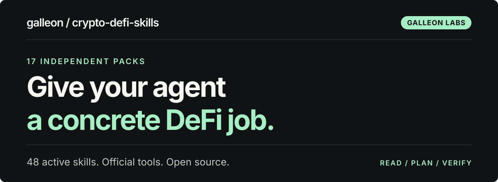

[](#start-with-one-skill)

# Crypto DeFi Skills

[](https://github.com/galleonlabs/crypto-defi-skills/actions/workflows/ci.yml)
[](docs/AGENT-INDEX.md)
[](LICENSE)

**Give your agent a concrete way to investigate, plan and verify DeFi work.** Stress-test an Aave position, review a swap, compare vault exits or trace a bridge to its destination. **48 active skills across 17 independent packs**, with official tool recipes, worked decisions and evidence for the next step.

## Start with one skill

Install one workflow into your existing agent:

```bash
npx skills add galleonlabs/crypto-defi-skills --skill galleon-aave-position
```

[Find your task](#choose-a-protocol-task) · [Install and run your first prompt](docs/GETTING-STARTED.md) · [Agent index](docs/AGENT-INDEX.md)

Want a complete Hermes setup? **[Start with Boomkin](https://github.com/galleonlabs/boomkin)** for an isolated DeFi profile, pinned pack selection and provider setup.

## Choose a protocol task

Choose the skill that names the job. Each procedure includes the inputs to read, the decisions to make, failure handling and what counts as completion.

| I want to… | Start here |
| --- | --- |
| Understand an Aave position and its liquidation buffer | [`galleon-aave-position`](packages/lending/skills/galleon-aave-position/SKILL.md) for V3 · [`galleon-aave-v4`](packages/lending/skills/galleon-aave-v4/SKILL.md) for V4 |
| Check whether a vault can return my assets now | [`galleon-vault-exit`](packages/yield/skills/galleon-vault-exit/SKILL.md) |
| Compare a bridge route or investigate a missing arrival | [`lifi-cross-chain`](packages/routing/skills/lifi-cross-chain/SKILL.md) |
| Prepare unsigned calls or inspect simulation evidence | [`galleon-defi-agent-plan`](packages/agent/skills/galleon-defi-agent-plan/SKILL.md) · [`galleon-defi-agent-simulate`](packages/agent/skills/galleon-defi-agent-simulate/SKILL.md) |
| Understand a stream's funding, debt or cancellation | [`galleon-sablier-streams`](packages/payments/skills/galleon-sablier-streams/SKILL.md) · [`galleon-superfluid-streams`](packages/payments/skills/galleon-superfluid-streams/SKILL.md) |
| Research a prediction market's rules and book depth | [`galleon-prediction-market-research`](packages/prediction/skills/galleon-prediction-market-research/SKILL.md) |

The [task guide](docs/GETTING-STARTED.md#find-your-next-task) covers liquidity, market data, staking, yields, payments and portfolio work. The [agent index](docs/AGENT-INDEX.md#skill-routing) lists every active skill and its routing boundary. Two retired LP install names remain as compatibility notices.

## Try a workflow

Replace the placeholders with your actual task inputs, then ask your agent:

> Use galleon-aave-position to inspect [Ethereum wallet address]. Show the current health factor and a scenario with a 20% collateral-price fall and 30 days of debt interest. Keep the plan unsigned.

> Use lifi-cross-chain to reconcile [source transaction hash] from Base to Arbitrum. Check [recipient address], the destination token and the amount actually received.

> Use galleon-prediction-market-research to examine [Polymarket market URL]. Explain the exact resolution rules, outcome identities and available order-book depth. Keep this research-only.

For more examples, open a pack's README from the directory below and use its first prompt. Provider credentials stay in your agent's private environment or secret settings.

## Independent packs

Install only the packs you need. Each has its own npm version, CLI, plugin manifests and self-contained skill resources; no pack requires another Galleon pack at runtime.

| Pack | npm release | Coverage |
| --- | --- | --- |
| [Agent](packages/agent) | [`galleon-defi-agent-skills@0.1.1`](https://www.npmjs.com/package/galleon-defi-agent-skills/v/0.1.1) | Official unsigned builders, playbooks and stateful simulation evidence |
| [Prediction](packages/prediction) | [`galleon-defi-prediction-skills@0.1.1`](https://www.npmjs.com/package/galleon-defi-prediction-skills/v/0.1.1) | Polymarket rules, order-book depth, versioned ledgers and resolution evidence |
| [Infra](packages/infra) | [`galleon-defi-infra-skills@0.4.1`](https://www.npmjs.com/package/galleon-defi-infra-skills/v/0.4.1) | RPC, wallet access, Alchemy, Coinbase and Hermes tool configuration |
| [Data](packages/data) | [`galleon-defi-data-skills@0.6.1`](https://www.npmjs.com/package/galleon-defi-data-skills/v/0.6.1) | CoinGecko, DeFiLlama, AIXBT and source-aware cross-protocol evidence |
| [LP](packages/lp) | [`galleon-lp-skills@0.6.1`](https://www.npmjs.com/package/galleon-lp-skills/v/0.6.1) | Uniswap, Aerodrome, Curve, Balancer, Revert and VFAT liquidity workflows |
| [Hyperliquid](packages/hyperliquid) | [`galleon-hyperliquid-skills@0.3.5`](https://www.npmjs.com/package/galleon-hyperliquid-skills/v/0.3.5) | Spot, perps, HIP-3, account modes, execution and review |
| [Lending](packages/lending) | [`galleon-defi-lending-skills@0.3.1`](https://www.npmjs.com/package/galleon-defi-lending-skills/v/0.3.1) | Aave, Morpho, Compound, Euler, Spark and Solana lending |
| [Staking](packages/staking) | [`galleon-defi-staking-skills@0.2.1`](https://www.npmjs.com/package/galleon-defi-staking-skills/v/0.2.1) | Lido, Rocket Pool, EigenLayer and Symbiotic staking and exits |
| [Yield](packages/yield) | [`galleon-defi-yield-skills@0.2.1`](https://www.npmjs.com/package/galleon-defi-yield-skills/v/0.2.1) | Vaults, Pendle PT/YT, Yearn, Spark savings and Ethena |
| [Tokenized Assets](packages/tokenized-assets) | [`galleon-defi-tokenized-assets-skills@0.1.3`](https://www.npmjs.com/package/galleon-defi-tokenized-assets-skills/v/0.1.3) | Ondo and OpenEden eligibility, issuer risk and settlement |
| [Routing](packages/routing) | [`galleon-defi-routing-skills@0.3.1`](https://www.npmjs.com/package/galleon-defi-routing-skills/v/0.3.1) | 0x, 1inch, CoW, Jupiter, LI.FI, Relay, Across and CCTP |
| [Derivatives](packages/derivatives) | [`galleon-defi-derivatives-skills@0.1.5`](https://www.npmjs.com/package/galleon-defi-derivatives-skills/v/0.1.5) | GMX, Derive, Drift and Pendle Boros trading lifecycles |
| [Strategy](packages/strategy) | [`galleon-defi-strategy-skills@0.1.1`](https://www.npmjs.com/package/galleon-defi-strategy-skills/v/0.1.1) | Daily spot backtests, costs, cash flows, drawdown and reproducible benchmarks |
| [Portfolio](packages/portfolio) | [`galleon-defi-portfolio-skills@0.2.1`](https://www.npmjs.com/package/galleon-defi-portfolio-skills/v/0.2.1) | Positions, liabilities, net exposure, cash flows and performance |
| [Security](packages/security) | [`galleon-defi-security-skills@0.2.3`](https://www.npmjs.com/package/galleon-defi-security-skills/v/0.2.3) | Token diligence, transaction decoding, permissions and simulation review |
| [Payments](packages/payments) | [`galleon-defi-payments-skills@0.2.1`](https://www.npmjs.com/package/galleon-defi-payments-skills/v/0.2.1) | Stablecoin transfers, x402, Sablier and Superfluid |
| [Governance](packages/governance) | [`galleon-defi-governance-skills@0.1.3`](https://www.npmjs.com/package/galleon-defi-governance-skills/v/0.1.3) | Snapshot, Cactus, Governor, voting and Safe execution |

## Install only what you need

The [Agent Skills installer](https://github.com/vercel-labs/skills) lets you select the receiving agent. List available skills or install a complete pack:

```bash
npx skills add galleonlabs/crypto-defi-skills --list
npx skills add https://github.com/galleonlabs/crypto-defi-skills/tree/main/packages/lending
```

Source commands follow `main`. For reproducible use, select a reviewed source revision or use an exact npm release. Published packages include a local corpus CLI and an ESM `SKILL_CATALOG` export:

```bash
npx --package galleon-defi-lending-skills@0.3.1 defi-lending-skills catalog --json
```

Node 20+ runs the published corpus CLIs. The CLI reads the bundled skills; the installer or Boomkin places them in your agent's discovery directory. Provider tools and optional helpers have their own runtime and access requirements.

Claude Code can install packs through `/plugin marketplace add galleonlabs/crypto-defi-skills`, then `/plugin install galleon-defi-lending-skills@galleon-defi`. Each pack also carries a Codex plugin manifest. The separate [research plugin](plugins/defi-research/README.md) has its own ZIP installation path.

See [the getting-started guide](docs/GETTING-STARTED.md#installation-options) for pack selection, plugins, pinned versions and first-use checks. Installation adds procedures; it does not authenticate a provider or grant wallet authority.

## What the skills give you

- **A usable procedure.** Concrete reads, amount units, calculations, decision branches and worked examples for the task.
- **Official tools in context.** Maintained SDK, API, CLI and MCP recipes with access, cost and deployment limits. Broad primitive workflows complement the named protocol procedures.
- **Evidence you can inspect.** Freshness and coverage limits, payload and permission review, transaction or order identity, and the balance or position evidence needed to finish.

Local helpers perform calculations or bounded diagnostics. The package CLIs do not sign or submit transactions. Research, unsigned planning, wallet execution and settlement stay distinct; preserve the user's authorization and resolve missing terms before consequential actions.

## Sources and verification

The [8 October ETH.sh review](docs/research/eth-skills-2026-10-08/README.md) maps **58 directory resources**, records fetched source documents and distinguishes discovered interfaces from unavailable or unverified ones. It informed the agent, prediction, Aave V4 and streaming workflows, plus provider updates across the collection.

[Skill quality](docs/SKILL-QUALITY.md) explains structural checks, clean installs and recorded output evaluations. [Research records](docs/research/report-source.md) retain primary sources and capability limits. Passing a format check, loading a skill or running a simulation does not establish a security audit, provider access or a financial outcome.

## Develop and release

```bash
bun install --frozen-lockfile
bun run check
bun run pack
```

Use Bun 1.3.14 for development. Run clean consumer smoke tests when package contents or installation change. Start with [CONTRIBUTING.md](CONTRIBUTING.md); agents editing the repository should read [AGENTS.md](AGENTS.md).

The root workspace is private. Packs publish independently under `<npm-name>@<version>` tags using [RELEASING.md](RELEASING.md). Discovery releases supply individual skill archives from an exact committed tree. [Migration notes](MIGRATION.md) preserve older LP names and repository paths.

## Contribute and reuse

Clearer examples, source-backed corrections and reproducible integration failures are welcome. Read the [contributor guide](CONTRIBUTING.md), or use [private vulnerability reporting](https://github.com/galleonlabs/crypto-defi-skills/security/advisories/new) for a security issue.

[MIT licensed](LICENSE), created by [Andrew Wilkinson](https://andrewwilkinson.io) and [Galleon Labs](https://github.com/galleonlabs). Retain the copyright and permission notice when reusing copies or substantial portions; [ATTRIBUTION.md](ATTRIBUTION.md) explains credit and third-party notices.
